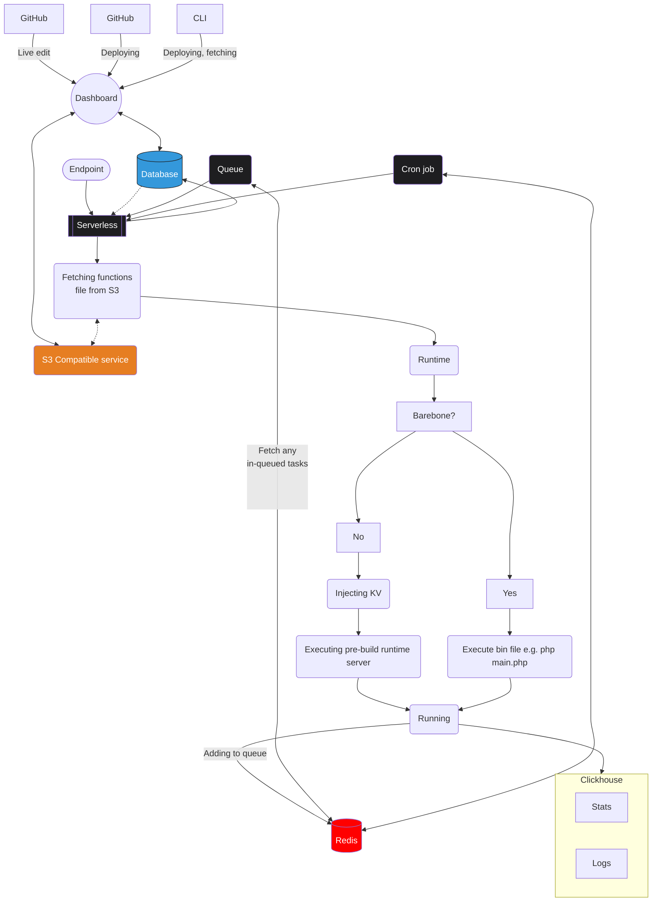

# Edgeable

_Current phase: **Idea**_

Enterprise-grade Serverless edge "able" cloud function.

With `Edgeable` you can easily deploy a cloud function to be executed over the edge. using `Edgeable` regularly can help with building request-intensive apps with Micro-servicing and separation of concerns in mind.

[Features](#-features) - [Packages](#-packages) - [Services](#-services-needed) - [Runtimes](#-runtimes) - [Ready to use & Barebone](#ready-to-use-rtu-vs-barebone-bb)

## ⚡️ Features

- High-availability and Scalability available by default.
- Ready-to-use & Barebone Workers.
- Global durable KV Objects.
- Live editor.
- Queue.
- Cron job - scheduler.
- Push to deploy.
- Uses Prisma ORM for a wide variety of DB engines.

## 🗄️ Packages

| Package                             | What for                                                                                                      | Technologies                                          | 
|-------------------------------------|---------------------------------------------------------------------------------------------------------------|-------------------------------------------------------| 
| [API](./packages/api)               | Admin API endpoints.<br/>To be used by the Dashboard, Cli and Webhook deployments.                            | [Bun](https://bun.sh/)                                |
| [Dashboard](./packages/dashboard)   | Frontend admin panel for manging:<br/>Organizations, Users and Functions.                                     | [Vue](https://vuejs.org/)                             |
| [Runtimes](./packages/runtimes)     | List of docker containers - continuously optimized by the community - for running `Edgeable` cloud functions. | [Docker](https://www.docker.com/)                     |
| [Serverless](./packages/serverless) | Request-hit endpoint, responsible for executing the current function.                                         | [Bun](https://bun.sh/)                                |
| [Cli](./packages/cli)               | All-in-one admin management utility for deploying & testing of `Edgeable` functions.                          | [Inquirer.js](https://www.npmjs.com/package/inquirer) |
| [Shared](./packages/shared)         | Common shared models and application logic.                                                                   | [TypeScript](https://www.typescriptlang.org/)         |
| [Docs](./packages/docs)             | Official `Edgeable` documentations.                                                                           | [VitePress](https://vitepress.dev/)                   |

Other libraries in use in this stack:

- [Prisma](https://www.prisma.io/stack) - ORM.

## 🛠️ Services needed

| Service     | What for                                          | Compatible services                                                                                                              |
|-------------|---------------------------------------------------|----------------------------------------------------------------------------------------------------------------------------------|
| Database    | Organizations, Users, Functions data and Settings | Anything that is supported by Prisma:<br/>MySQL, MariaDB, PostgresSQL, SQL Server, SQLite, MongoDB, CockroachDB and PlanetScale. |
| Storage     | Function zipped deployments and builds            | S3 Compatibles, e.g.:<br/>S3, R2, Wasabi and more.                                                                               |
| KV Database | Queue, Cache                                      | Redis.                                                                                                                           |
| Realtime DB | Usages, live functions logs.                      | Clickhouse                                                                                                                       |

- `Edgeable` recommending [PlantScale](https://planetscale.com/) for high-availability database.
- `Edgeable` recommending [R2](https://www.cloudflare.com/products/r2/) for region-worry-free object storage.

## 🧰 Runtimes

| Runtime               | RTU (RPS) | BB | Priority |
|-----------------------|-----------|----|---------:|
| JavaScript - **Bun**  |           |    |       10 |
| JavaScript - **Node** |           |    |        9 |
| JavaScript - **Deno** |           |    |        5 |
| PHP - **RoadRunner**  |           |    |       10 |
| PHP - **Swoole**      |           |    |        9 |
| PHP - **FPM**         |           |    |        9 |
| .NET                  |           |    |        7 |
| Python                |           |    |        7 |
| Dart                  |           |    |        7 |
| Java / Kotlin         |           |    |        7 |
| Go                    |           |    |        6 |
| Rust                  |           |    |        6 |
| Swift                 |           |    |        6 |
| Ruby                  |           |    |        5 |
| Perl                  |           |    |        5 |
| Crystal               |           |    |        5 |
| R                     |           |    |        3 |

## Ready-to-use (RTU) vs Barebone (BB)

When deploying function to `Edgeable` the deployment can be integrated into a RTU worker that enjoys all
other `Edgeable` functionalities, Or, use a BB worker with 100% control over the worker.

### RTU

Ready-to-use workers require the function to be written in a pre-determined way. as the function will run by an
internal `Edgeable` server.

When using RTU worker you can rest assure you're getting the community optimized edition of server implementation for that runtime.

Also, Global KV object are available only for RTU workers. The reason is that the KV object must be injected before it can be used.

Example code of a RTU worker writing in Bun.

```ts
export default async function (ctx: EdgeableContext) {
    // Access a durable globally available KV object.
    const ConfigKV = ctx.durable['ConfigKV'];

    return ctx.json({success: true});
}
```

### BB

Some time there's a need to have full control over the worker. This is very common for custom-made application that you
want to be available over the edge. For that you can create and use a BB worker.

Example code of BB worker writing in Bun

```ts
Bun.serve({
    port: 3000,
    fetch(req) {
        return new Response(JSON.stringify({success: true}), {
            headers: {
                "Content-Type": "application/json",
            }
        });
    },
});
```

## [MermaidJS](https://mermaid.js.org/) infrastructure diagram



### Notes.

This project was inspired by

- Appwrite [Function](https://appwrite.io/docs/functions) and the [OpenRuntime](https://github.com/open-runtimes/open-runtimes) project.
- Cloudflare [workers](https://developers.cloudflare.com/workers/). 